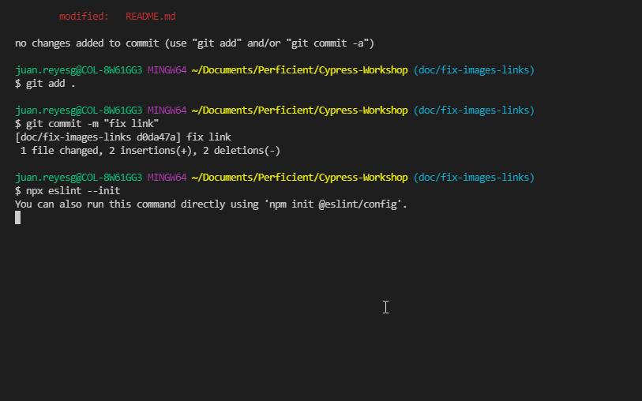

# Workshop Cypress

Bienvenido al Workshop de Cypress!!! Durante el taller exploraremos los conocimientos necesarios para construir pruebas automaticas de la interfaz gráfica (GUI) usando Cypress. Durante el taller exploraremos la configuración de un proyecto desde cero, prepararlo para un proceso de integración continua por medio de Travis CI, interactuar con diferentes componentes web y mucho mas.

Para el desarrollo del taller usaremos [GitHub](https://github.com/) y [GitHub Flow](https://guides.github.com/introduction/flow/) para realizar la entrega de cada ejercicio practico.

Ten en cuenta tener estudiados ciertos conceptos importantes (te dejamos unos enlaces :sunglasses:):

* [Git](https://www.freecodecamp.org/news/learn-the-basics-of-git-in-under-10-minutes-da548267cc91/)
* [JavaScript](https://javascript.info/)

**Tips de GitHub Flow:**

1. Para cada ejercicio crear una rama (Investiga: *gitflow naming conventions* )
2. Crea un Pull Request por cada punto (**Recuerda las interacciones como comentarios en ingles**)
3. Despues de que se recibe aprobación de cada punto se debe hacer merge de la rama, utilizando squash.
4. Antes de empezar un nuevo punto se debe hacer pull de main para asegurarnos que tenemos los ultimos cambios del anterior punto.

## Tabla de contenidos

1. [Creación y configuración del repositorio](#1-creación-y-configuración-del-repositorio)
1. [Configuracion inicial del proyecto](#2-configuracion-inicial-del-proyecto)
1. [Instalación de Cypress](#3-instalación-de-cypress)
1. [Creando la primera prueba](#4-creando-la-primera-prueba)
1. [Configurando las pruebas con TypeScript](#5-configurando-las-pruebas-con-typescript)
1. [Análisis de código estatico](#6-análisis-de-código-estatico)
1. [Configurar Integración Continua (CI)](#7-configurar-integracion-continua-ci)
1. [Selectores CSS](#8-selectores-css)
1. [Page Object Model (POM)](#9-page-object-model-pom)
1. [Mejorando los selectores](#10-mejorando-los-selectores)
1. [AAA pattern](#11-aaa-pattern)
1. [Listas de elementos, filtros y elementos dentro de elementos](#12-listas-de-elementos-filtros-y-elementos-dentro-de-elementos)
1. [Mejorando los reportes - Mochawesome](#13-mejorando-los-reportes---mochawesome)
1. [Filling form](#14-filling-form)
1. [Subiendo un archivo](#15-subiendo-un-archivo)
1. [Descargando un archivo](#16-descargando-un-archivo)
1. [Interactuando con IFrames](#17-interactuando-con-iframes)

## 1. Creación y configuración del repositorio

1. Crear un repositorio en GitHub con el nombre de **cypress-training** (previo requisito disponer de una cuenta en GitHub, no seleccione ninguna opcion de inicializacion de repositorio).
2. Crear localmente una carpeta con el nombre de **cypress-training** y luego sitúese dentro de la carpeta.
3. Crear el archivo **.gitignore** en la raíz del proyecto, luego ingrese a la página <https://www.toptal.com/developers/gitignore> y en el campo de texto digite su sistema operativo (ej: windows, osx, macos) y selecciónelo de la lista de autocompletar. Repita este paso para su entorno de desarrollo (ej:vscode, sublime, intellij, jetbrains), también agregue la palabra `node` y por ultimo `CypressIO`. Presione el botón "Create" para crear el archivo que contendrá una lista de carpetas y archivos de exclusión y copie su contenido dentro del archivo **.gitignore**. Por último, agregue a la seccion de cypress de su archivo **.gitignore** las siguientes líneas para no subir las pruebas que hacen parte del demo:

    ```bash
    ...
    cypress/integration/examples/*
    ...
    ```

4. A continuación realice el primer commit y suba los cambios a nuestro repositorio remoto de GitHub, digitando los siguientes comandos en tu consola favorita, cada linea es un comando distinto:

    ```bash
    echo "# cypress-training" >> README.md
    git init
    git add README.md
    git add .gitignore
    git commit -m "first commit"
    git remote add origin https://github.com/<usuario>/cypress-training.git
    git push -u origin main
    ```

5. Proteger la rama `main` para que los pull request requieran revisión de otros desarrolladores y se compruebe el estado de nuestros test ("ok" :heavy_check_mark: o "fallaron" :x:) antes de hacer un merge a la rama.

    Ir a Settings > Branches adicionamos una regla dando click en **add rule**. Escribimos `main` en el campo de **branch name pattern**. Una vez hecho eso, damos click en las siguientes opciones:
    
6. Añadir como colaboradores a:
   * [holgiosalos](https://github.com/holgiosalos)
   * [Valeryibarra](https://github.com/Valeryibarra)
   * [renardete](https://github.com/renardete)
   * [aperdomob](https://github.com/aperdomob)

## 2. Configuracion inicial del proyecto

1. Instalar la versión `v16.14.0` de Node.js. Nota: Recomendamos usar [nvm](https://github.com/nvm-sh/nvm) como manejador de versiones.
2. Crear una nueva rama local ejecutando por consola `git checkout -b setup`.
3. Crear una carpeta en la raíz del proyecto llamada `.github` con un archivo llamado `CODEOWNERS` (sin extensión) con lo siguiente:

    ```js
    * @david31982 @holgiosalos @JuanDelahozMiranda @manuelq12 @valeryibarra
    ```

4. Ejecutar en consola `npm init` y colocar la siguiente información:
    | Parámetro          | Valor                                         |
    | ------------------ | ----------                                    |
    | **Name**           | cypress-training                              |
    | **Version**        | *[Por Defecto]*                               |
    | **Description**    | This is a Workshop about Cypress              |
    | **Entry Point**    | *[Por Defecto]*                               |
    | **Test Command**   | `cypress open`                                |
    | **Git Repository** | *[Por Defecto]*                               |
    | **Keywords**       | ui-testing, dojo, practice, cypress           |
    | **Author**         | *[Su nombre]* <*[Su correo]*> (*[su GitHub]*) |
    | **License**        | MIT                                           |

5. Realizar un commit donde incluya los archivos creados con el mensaje “setup project configuration” y subir los cambios al repositorio:

    ```bash
    git add .
    git commit -m "setup project configuration"
    git push origin setup
    ```

6. Crear un pull request (PR), asignarle los revisores y esperar la aprobación o comentarios de mejora (en este caso deberá hacer los ajustes requeridos, subir los cambios y esperar nuevamente la aprobación) de los revisores . Si no sabe cómo realizarlo, le recomendamos leer el siguiente artículo [instrucciones](https://help.github.com/articles/creating-a-pull-request/).

7. Una vez hemos obtenido la aprobación de los revisores, realizar el merge a main seleccionando la opción “squash and merge” (squash te permite unir todos los commits en un solo, es más por un concepto de organización). Posteriormente, en su rama local "main" realice el pull para traer los cambios mergeados en el PR.

    ```bash
    git checkout main
    git pull
    ```

## 3. Instalación de Cypress

> **Nota Importante:** Este Workshop es compatible con la version 9.x de Cypress, algunos cambios en la configuracion son requeridos para hacerla compatible con la version 10. Sin embargo puedes consultar [esta guía de migración](https://docs.cypress.io/guides/references/migration-guide#Migrating-to-Cypress-version-10-0) para saber que cambios debes hacer cuando el workshop te pida cambiar los archivos de configuracion.

1. Ejecutar el siguiente comando:

    ```bash
    npm install -D cypress
    ```

2. Esto instalará cypress dentro del **node_modules**. Para verificar la correcta instalacion y ver el demo de cypress, ejecutamos el siguiente comando:

    ```bash
    npm test
    ```

3. Presionar el botón `Run integration specs` para ejecutar todas las pruebas de ejemplo. Es aquí donde vemos cómo funciona la magia de cypress. Una vez finalice, cerramos la ventana de cypress.
4. Observar que se crea una carpeta llamada **cypress** con la siguiente estructura ([Extra info!!](https://docs.cypress.io/guides/core-concepts/writing-and-organizing-tests.html#Folder-Structure)):

5. Modificar el archivo `package.json` la propiedad `test` ubicada dentro de la seccion de `scripts` para que quede de la siguiente manera:

    ```javascript
    ...
    "scripts": {
        "test:open": "cypress open"
      },
    ...
    ```

6. Ésto hará que el comando `test:open` ejecute la instrucción `cypress open`. Ejecuta el comando `npm run test:open` para verificar que el demo de cypress ahora se inicia con este comando.
7. Crear una rama y realizar un commit donde incluya los archivos creados y/o modificados en esta sección, con el mensaje “setup cypress configuration” y subir los cambios al repositorio
8. Crear un pull request (PR), asignarle los revisores y esperar la aprobación o comentarios de mejora
9. Una vez hemos obtenido la aprobación de los revisores, realizar el merge a main seleccionando la opción “squash and merge” (squash te permite unir todos los commits en un solo, es más por un concepto de organización). Posteriormente, en su rama local "main" realice el pull para traer los cambios mergeados en el PR.

## 4. Creando la primera prueba

Una vez hemos ejecutado las pruebas de ejemplo, eliminamos las carpetas que contienen ejemplos: `cypress/integration/1-getting-started` y `cypress/integration/2-advanced-examples`.

1. Creamos un archivo llamado `google.spec.js` dentro de la carpeta `/cypress/integration/` con el siguiente contenido:

    ```javascript
    describe("This is my first cypress test", () => {
        it("should have a title", () => {
            cy.visit("https://www.google.com/");
            cy.title().should("eq", "Google");
        });
    });
    ```

2. Ejecutar el comando `npm run test:open` para correr la prueba. Una vez finalice y si todo está bien veremos que la prueba paso satisfactoriamente:


## 5. Configurando las pruebas con TypeScript

1. Instalar las dependencias necesarias para la transpilación de nuestras pruebas escritas en TypeScript a JavaScript por medio de la instalacion de la dependencia de TypeScript.

    ```bash
    npm install --save-dev typescript
    ```

2. Crear el archivo tsconfig.json en la raiz del proyecto y copiar dentro de este la siguiente configuración:

    ```javascript
    {
        "compilerOptions": {
            "target": "es5",
            "skipLibCheck": true,
            "strict": true,
            "lib": ["es5", "dom"],
            "types": [
                "cypress",
                "node"
            ]
        },
        "include": [
            "cypress/**/*.ts"
        ],
        "exclude": [
            "node_modules/"
        ]
    }
    ```

3. Cambiar la extensión de nuestra prueba `google.spec.js` por `google.spec.ts`y ejecutar el comando de pruebas para comprobar que la transpilación se ejecuta correctamente al correr las pruebas

```bash
npm test
```

## 6. Análisis de código estatico

1. Para realizar el análisis de código estatico usaremos la herramienta ESLint para validar un conjunto de reglas sobre el código de pruebas y mantener un estilo consistente. Para esto se debe instalar ESLint como dependecia de desarrollo, luego iniciar la configuración del linter y seguimos los pasos que aparecen en consola (ver respuestas sugeridas y gif):

    ```bash
    npm install eslint --save-dev
    npx eslint --init
    ```

    <details>
    <summary><b><u>Mostrar configuracion detallada eslint</u></b></summary>

    ```bash
    ? How would you like to use ESLint?
    Opcion 3:   To check syntax, find problems, and enforce code style

    ? What type of modules does your project use? ...
    Opcion 1: > JavaScript modules (import/export)

    ? Which framework does your project use? ...
    Opcion 3: > None

    Does your project use TypeScript?
    Yes

    ? Where does your code run?
    Opcion 1: > Browser

    ? How would you like to define a style for your project? ...
    Opcion 1: > Use a popular style guide

    ? Which style guide do you want to follow? ...
    Opcion 3: > Google

    ? What format do you want your config file to be in? ...
    Opcion 1: > JavaScript

    ? Would you like to install them now with npm?
    Yes
    ```

    </details>

    .

2. Instalar una extension del linter para cypress que contiene reglas de estilo siguiendo las buenas practicas que sugiere cypress:

    ```bash
    npm install eslint-plugin-cypress --save-dev
    ```

3. Luego agregar el plugin de cypress y las reglas en el archivo eslintrc.js

    ```javascript
    ...
        "plugins": [
          "@typescript-eslint",
          "cypress"
        ],
        "rules": {
          "quotes": ["error", "double"],
          "cypress/no-assigning-return-values": "error",
          "cypress/no-unnecessary-waiting": "error",
          "cypress/assertion-before-screenshot": "warn",
          "cypress/no-force": "warn",
          "no-unused-vars": "warn",
          "require-jsdoc": "warn",
          "max-len": [ "error", { "code": 120 } ]
        },
    ...
    ```

4. Posteriormente modificamos el script test:open en el "package.json" para ejecutar la verificación de código estático antes de correr las pruebas:

    ```json
    "scripts": {
        "test:open": "npm run lint && cypress open",
        "lint": "eslint ./cypress/integration/**/*.ts",
        "lint:fix": "npm run lint -- --fix"
    },
    ```

5. Ejecutamos las pruebas por corriendo el comando test:open

```bash
npm run test:open
```

Nota: En caso de tener errores, algunos de ellos son posible arreglarlos autoáticamente añadiendo el argumento --fix, es decir, usamos `npm run lint -- --fix`.

## 7. Configurar Integracion Continua (CI)

En esta sección se configura la integración continua por medio de GitHub Actions, lo cual nos permitirá correr nuestras pruebas en un servidor remoto y validar continuamente que los cambios que vamos a ingresar a nuestra aplicación no han afectado su funcionamiento correcto.

1. Inicialmente crear el siguiente script en el package.json para ejecutar todas las pruebas de cypress/integration/ sin tener que levantar la interfaz grafica del explorador. A esto le llamamos "headless mode":

    ```javascript
    "scripts": {
        ...
        "test": "cypress run"
        ...
      },
    ```

2. Para crear la configuracion del workflow de GitHub actions, vamos a crear un archivo `main.yml` en el directorio `.github/workflows` que realice los siguientes `steps` cuando creamos o actualizamos un Pull Request:

    1. Obtener nuestro repositorio (A esto se le conoce como checkout)
    2. Preparar el workflow para usar Node.js v16
    3. Instalar dependencias
    4. Ejecutar el analisis de codigo estatico
    5. Ejecutar las pruebas E2E que hemos construido

    *Nota*: Intenta construir tu workflow, pero si te bloqueas, abajo tienes una seccion con una posible solucion

    <details>
    <summary><b><u>Mostrar una solucion</u></b></summary>

    ```yml
    name: Continuous integration

    on: [pull_request]

    jobs:
      cypress-run:
        runs-on: ubuntu-latest
        steps:
          - name: Checkout
            uses: actions/checkout@v2

          - name: Setup
            uses: actions/setup-node@v2
            with:
              node-version: 16
              cache: 'npm'

          - name: Install
            run: npm ci

          - name: Code style
            run: npm run lint

          - name: UI E2E Tests
            uses: cypress-io/github-action@v2
            with:
              browser: chrome
              headless: true

      ```

      *Nota*: El action de cypress ejecuta por default el comando `npm test`

      </details>

3. Crea el archivo `.nvmrc` y especifica la version de Node.js que seas usar para la ejecución.

4. Debido a que cypress por default graba videos de la ejecución de las pruebas es util desactivar esta funcionalidad para disminuir el tiempo de ejecución y el uso de recursos en el servidor del CI. Adicionalmente, desactivaremos temporalmente las capturas de pantalla debido a un [error](https://github.com/cypress-io/cypress/issues/5016) que aun no ha sido solucionado en las versiones recientes de cypress. Para esto se debe ingresar la siguiente configuración en el archivo `cypress.json`

    ```json
    {
      ...
      "video": false,
      "screenshotOnRunFailure": false
      ...
    }
    ```

5. Finalmente subir los cambios al repositorio y crear un Pull Request. Se ejecutaran las pruebas en el servidor que provee Travis y se mostrara los resultados de la ejecución en el PR.

## 8 Selectores CSS

En esta sección se realiza un flujo para comprar una camiseta en la tienda de ropa: <http://automationpractice.com/>, vamos a usar los CSS selector para interactuar con cada elemento del DOM.

:scroll: Un poco de teoria: Para interactuar con los elementos del DOM se pueden usar varios mecanismos como CSS selectors, XPATH, jquery+CSS. Cada uno de estos tiene diferentes beneficios como su performance, legibilidad o la complejidad de la query del elemento con el cual queremos interactuar. Usualmente los CSS selector suelen ser mas rapidos y confiables en la mayoria de navegadores sin embargo lo XPATH permiten realizar busquedas de elementos mas complejas. Te recomendamos investigar las diferencias entre ambos tipos de selectores teniendo en cuenta factores como: manteniblidad, flexiblidad y velocidad de busqueda de un elemento.

Vamos a realizar los siguientes pasos, para automatizar el flujo de compra:

1. Primero crear el archivo `buy-shirt.spec.ts` e incluir el siguiente codigo:

    ```typescript
    describe("Buy a t-shirt", () => {

      it("then the t-shirt should be bought", () => {
        cy.visit("http://automationpractice.com/")
        cy.get("#block_top_menu > ul > li:nth-child(3) > a").click()
        cy.get("#center_column a.button.ajax_add_to_cart_button.btn.btn-default").click()
        cy.get("[style*="display: block;"] .button-container > a").click()
        cy.get(".cart_navigation span").click()

        cy.get("#email").type("aperdomobo@gmail.com")
        cy.get("#passwd").type("WorkshopProtractor")

        // Debes completar la prueba ...

        cy.get("#center_column > div > p > strong")
          .should("have.text", "Your order on My Store is complete.")
      });
    });
    ```

    El flujo que debes continuar es:

    * Seccion Address: Continuar el checkout
      * Seccion Shipping:
        * Aceptar terminos y condiciones
        * luego continuar el checkout
      * Seccion Payment:
        * click en pay by bank wire
        * confirmar orden

    Usa como apoyo las siguientes imagenes para conocer mas del flujo esperado, extrae los CSS selector de la UI manualmente, termina la prueba y correla local.

    

    

2. En algunos la red u otros factores externos a la prueba pueden afectar los tiempos de espera, en el archivo de configuración de cypress `cypress.json` agrega los siguientes atributos y modificalos hasta que las pruebas pasen:

    ```json
    {
      ...
        "defaultCommandTimeout": 20000,
        "responseTimeout": 20000
      ...
    }
    ```

3. Para finalizar sube tus cambios al repositorio y crea un PR.

## 9 Page Object Model (POM)

Page Object Model es un patron para mejorar la mantenibilidad de las pruebas ya que podemos establecer una capa intermedia entre las pruebas y UI de la aplicación, ya que los cambios que requieran las pruebas debido a cambios en la aplicación se pueden realizar rapidamente en el POM. Te recomendamos investigar el patrón y otros patrones utiles que puedan ser usados para el código de pruebas.

A continuación realizar la transformación a POM, por medio de los siguientes pasos:

1. Crear el archivo `cypress/page/menu-content.page.ts` y agregar el siguiente código:

    ```javascript
    class MenuContentPage {
        private tShirtMenu: string;
        private menuContentPageURL: string

        constructor() {
            this.tShirtMenu = "#block_top_menu > ul > li:nth-child(3) > a";
            this.menuContentPageURL = "http://automationpractice.com/"
        }

        public visitMenuContentPage(): void {
            cy.visit(this.menuContentPageURL)
        }

        public goToTShirtMenu(): void {
            cy.get(this.tShirtMenu).click()
        }
    }

    export { MenuContentPage }
    ```

2. Posteriormente crear el archivo `cypress/page/index.tx` para usar como archivo de salida de todos los page object:

    ```javascript
    export { MenuContentPage } from "./menu-content.page"
    ```

3. Luego modificar el archivo `buy-tshirt.spec.ts` para utilizar el POM que acabamos de crear en la prueba:

    ```javascript
    import { MenuContentPage } from "../page/index"

    const menuContentPage = new MenuContentPage()

    describe("Buy a t-shirt", () => {

      it("then should be bought a t-shirt", () => {
        menuContentPage.visitMenuContentPage()
        menuContentPage.goToTShirtMenu()
        cy.get("[style*="display: block;"] .button-container > a").click()
        cy.get(".cart_navigation span").click()

        // El resto del flujo de la prueba....

      });
    });
    ```

4. Posteriormente, crear el resto de page object y reemplazarlos en la prueba. Los nombres de los page object son: **products-list.page.ts**, **shoping-cart.page.ts**, **login.page.ts**, **address-step.page.ts**, **shipping-step.page.ts** y **payment-step.page.ts**

    *tip:* Agrega los page object al archivo "page/index.ts" para facilitar el import de cada page object en las pruebas.

5. Ejecute las pruebas y verifica que pasen. Si alguna falla modificala usando los CSS locators y el tiempo de espera configurado hasta que pasen.

6. Cree un PR y solicitie revisión del punto anterior.

## 10. Mejorando los selectores

En esta sección presentaras una propuesta para los selectores que se estan usando para la pruebas:

1. Realice su propia propuesta de los selectores de cada page object.
2. Verificar que las pruebas pasen
3. Crear un PR y solicitar revisión. El revisor comentará los selectores con los que no esta de acuerdo, en ese caso, justifique su propesta de selector. (No use **XPATH**)

## 11. AAA pattern

Un patrón común para escribir pruebas es el patrón AAA que nos ayuda a definir una estructura ordenada de cada prueba, por medio de 3 pasos:

* **Arrange**: Preparar las condiciones necesarias para ejecutar la prueba, ej: Datos de la prueba, carga de pagina donde se ejecuta la prueba.
* **Action**: Es la acción del usuario que realmente vamos a probar, Ej: llenar formularios, navegar a otra pagina, hacer clicks.
* **Assert**: Verificamos los comportamientos esperados. Ej: Se muestre cierta información, guardado de datos, actualización de datos, mensajes de error, etc...

Vamos a agregar una nueva prueba y la estructuramos usando el patrón AAA:

`Escenario:` Verificar que al navegar a la pagina de vestidos se muestren los vestidos disponibles y sus nombres.

1. Primero agregamos el archivo del Page Object para la pagina de vestidos, (recuerda agregarlo al `index.ts` de la carpeta `/page`):

    ```javascript
    class DressesListPage {

      private dressItem: string;
      private dressName: string;

      constructor(){
        this.dressItem = ".product-container"
        this.dressName = `${this.dressItem} .product-name`
      }

      getDressProducts(){
        return cy.get(this.dressItem)
      }

      validateItemsNumber(itemsNumber: number){
        cy.get(this.dressItem).should("have.length", itemsNumber)
      }

      validateItemsNames(names: string[]){
        cy.get(this.dressName).each((item, index) => {
          cy.wrap(item).should("contain.text", names[index])
        })
      }

    }

    export {DressesListPage}
    ```

2. Creamos el archivo `dresses-list.spec.ts` para realizar la prueba de la lista de vestidos.

    ```javascript
    import { MenuContentPage, DressesListPage } from "../page/index"


    describe("the user navigates to the dresses page should", () => {

      let menuContentPage: MenuContentPage;
      let dressesListPage: DressesListPage;

      before(() => {
        menuContentPage = new MenuContentPage();
        dressesListPage = new DressesListPage();
      })

      it("show the available dresses", () => {
        // ... realiza la prueba
      })
    })
    ```

3. Crea la prueba teniendo en cuenta el patrón AAA:
    1. Arrange: Crea un arreglo con los nombre esperados de cada vestido y visita la página del menu principal.
    2. Action: Navega al menu de vestidos donde se carga la lista de vestidos diponibles.
    3. Assert: Verifica que se visualicen 5 vestidos y que tengan los nombres esperados (el orden es importante).

    **tip:** Recuerda aplicar los Page Object al construir la prueba.
    **Challenge:** Investiga como funciona los métodos **validate** en el archivo `dresses-list.page.ts`.

4. Actualiza la prueba de comprar tshirt en el archivo `buy-tshirt.spec.ts` para que siga el patrón AAA.

5. Verifica que las pruebas corran bien, crea un PR y solicita la revisión.

## 12. Listas de elementos, filtros y elementos dentro de elementos

En algunos escenarios debemos trabajar con lista de elementos, realizar busquedas sobre locator anidados o realizar acciones sobre elementos hijos del selector que tenemos disponible.

1. Agregar una variable privada dentro del page object `products-list.page.ts` con un selector que obtendra todos los elementos HTML de los productos.

2. Cree un método privado llamado `findProductByName` el cual debe retornar el contenedor (elemento HTML) del producto cuyo nombre se pasa por parametro. Puedes basarte en el comando **filter** de cypres, revisa la API de Cypress: [API de cypress](https://docs.cypress.io/api/api/table-of-contents.html)

3. Modifica el método `addTShirtToCart()` para que reciba por parametro el nombre del producto. Usa el método creado previamente para darle click al boton de "Add to Cart" del producto. Puedes revisar el comando **find** the cypress.

4. Ejecuta las pruebas y verifica que pasen :heavy_check_mark:

5. Sube la rama, crea un pull request y solicita la revisión del cambio

## 13. Mejorando los reportes - Mochawesome

Algunas veces es bueno mejorar el reporte visual de la ejecución de nuestras pruebas, para eso agregaremos `mochawesome` y lo integraremos con cypress. Siga los siguientes pasos:

1. Instalaremos las siguientes dependencias:

    ```bash
    npm install mocha mochawesome cypress-mochawesome-reporter --save-dev

    # Para mantenr el reporte actual (en la terminal) y agregar mochawesome
    npm install cypress-multi-reporters --save-dev

    # Para procesar los reportes generados al terminar la ejecución
    npm install mochawesome-merge --save-dev
    npm install mochawesome-report-generator --save-dev
    ```

2. Agregamos la siguiente configuración al archivo `cypress.json`:

    ```json
    "reporter": "cypress-multi-reporters",
        "reporterOptions": {
            "reporterEnabled": "mochawesome",
            "mochawesomeReporterOptions": {
                "reportDir": "cypress/reports/mocha",
                "quite": true,
                "overwrite": false,
                "html": false,
                "json": true
            }
        }
    ```

3. Agrega script en el `package.json` para limpiar la carpeta `cypress/reports`

    **tip:** Ten en cuenta que el servidor de CI corre en linux.

4. Agrega estos sripts para procesar el reporte generado al ejecutar las pruebas:

    ```json
    {
      "combine-reports": "mochawesome-merge cypress/reports/mocha/*.json > cypress/reports/report.json",
      "generate-report": "marge cypress/reports/report.json -f report -o cypress/reports",
    }
    ```

5. Invetiga los hooks **pre** y **post** de npm para ejecutar scripts antes y despues de las pruebas:

    * **pre:** Limpiar el la carpeta de reportes
    * **post:** ejecutar los scripts para procesar el reporte generado por la ejecución de pruebas.

6. Sube el cambio con una foto del reporte generado por `mochawesome`, crea un PR y solicita la revisión.

## 14. Filling form

Usualmente en las aplicaciones nos encontramos formularios que los usuarios deben llenar para guardar información. En esta sección interactuaremos con algunos de los componentes más comunes que nos podemos encontrar. La prueba consiste en:

**tip:** Recuerda crear un page object e implementar la prueba con el patrón AAA

1. Visitar la página: [Formulario de pruebas automatización](https://demoqa.com/automation-practice-form)
2. Construir un método que llene el formulario y de click en el boton de **submit**:

    ```javascript
    const personalInformation = {
          name: "Holmes",
          lastName: "Salazar",
          email: "hibarras@email.com",
          gender: "Male",
          mobileNumber: "3656589156",
          hobbies: ["Music", "Reading"],
          currentAddress: "Av siempreViva # 123",
        }
    personalFormPage.fillForm(personalInformation)
    ```

    **tip:** Recuerda crear un page object e implementar la prueba con el patrón AAA

    <details>
    <summary><b><u>Nota:</u></b> Si tienes problemas con la ejecucion de las pruebas en esta pagina, te sale un mensaje de error de tipo "uncaught exception", click aqui para ver una solucion.</summary>

    Agrega las siguientes lineas al final del archivo: `cypress/support/commands.js`

    ```javascript
    // Ignoring uncaught exceptions since errors from external apps should not stop de workshop
    Cypress.on('uncaught:exception', (err, runnable) => {
        // returning false here prevents Cypress from
        // failing the test
        return false
    })

    ```

    </details>

3. Verifique la data que ingreso en el modal que se muestra al enviar el formulario

    **mini-challenge:** Agregue la interacción con el campo de State y City y verifique el modal (puntos extra!! :100:)

4. Verifique que las pruebas pasen, cree un PR y solicite la revisión.

## 15. Subiendo un archivo

Usualmente nos podemos encontrar con la necesidad de subir archivos por medio de nuestra aplicación web. Realizaremos los siguiente:

1. Instalar el plugin de cypress para subir archivos: [cypress-file-upload](https://www.npmjs.com/package/cypress-file-upload). Sigue las instrucciones de configuración.

2. Crea el archivo `upload.page.ts` que contenga tres metodos:

    * visitar la página de pruebas de subida de archivos: [upload-demo-site](http://demo.automationtesting.in/FileUpload.html)
    * Subir un archivo. Recibe como parametro el nombre del archivo almacenado en la carpeta: `cypress/fixtures`
    * Obtener el elemento del titulo que contiene el nombre despues de subir

3. Crea el archivo de pruebas `upload-download.spec.ts` y agrega una prueba para subir un archivo usando el page object creado anteriormente. Recuerda estructurar tu prueba con el pátron AAA.

    **tip:** El patrón AAA es solo para ayudarnos a tener mas orden al diseñar y contruir nuestras pruebas.

4. Verifica que las pruebas pasen, crea un PR y solicita revisión.

## 16. Descargando un archivo

Para esta sección descargaremos un archivo y verificaremos el contenido, realizaremos la siguiente prueba:

1. Construye la siguiente prueba en el archivo `upload-download.spec.ts`:

    * Visita la página: [download-demo-site](http://demo.automationtesting.in/FileDownload.html)
    * Genera un archivo con data ingresada en la prueba automática y descargalo.
    * Verifica que el archivo descargado tenga el contenido que ingresaste en la prueba.

2. Crea el archivo `download.page.ts` con los método necesarios para construir la prueba automatica.

3. Verifica que todas las pruebas pasen, además incluye los archivos que no se deben subir al `.gitignore`.

4. Crea un PR y solicita revisión.

## 17. Interactuando con IFrames

Los iframes son elementos HTML que nos podemos encontrar comunmente en aplicaciones web antiguas, pero es bueno saber como interactuar con ellos. En esta sección interactuaremos, navegaremos y verificaremos data dentro de un iframe.

1. Primero instalaremos el siguiente plugin de cypress: [Cypress Iframe](https://www.npmjs.com/package/cypress-iframe). Sigue las instrucciones del link.

2. Crea un page object `iframe.page.ts` que contenga los siguiente métodos:

    ```javascript
    visit(){
      // visit the test page: https://www.w3schools.com/html/html_iframe.asp
    }

    getFrameTitle(){
      // get the title of the page in the iframe
    }

    goToCssPageInFrame(){
      // navigate to the css page in the iframe
    }
    ```

3. Crea un archivo de pruebas llamado `iframe.spec.ts` y construye las siguientes pruebas:

    * Cuando un usuario navega a la pagina: [pagina iframe](https://www.w3schools.com/html/html_iframe.asp) se muestra un Iframe que tiene como titulo `HTML Tutorial`

    * **Optional:** Cuando un usuario navega a la pagina: [pagina iframe](https://www.w3schools.com/html/html_iframe.asp) se muestra un Iframe y cuando el usuario navega a la pagina de CSS al darle click en la barra de navegación, se carga la pagina de CSS dentro del IFrame con el titulo `CSS Tutorial`

    **Challenge:** algunas pruebas pueden ser inestables por diferentes factores como latencias. Implementa una estrategia de retrys si encuentras alguna inestabilidad!

4. Verifica que las pruebas pasen, crea un PR y solicita la revisión.

## Conclusión

Muchas gracias por haber participado del Workshop de Cypress!!!!! Esperamos que tengas nuevos conocimientos que impulsen tu carrera profesional.

Te invitamos a seguir aprendiendo, y te dejamos unos temas para que investigues y sigas estudiando:

* Component testing UI
* End-to-End Testing API
* Component Testing API
* Mutatation Tests
* Contract Tests

Sigue aprendiendo! :smile: :book:

## Challenges

Hay muchos temas que puedes seguir aprendiendo y herramientas que puedes incluir, estos son algunos de los Retos que te dejamos :smiley:

### Given - When - Then

Otro estilo de escritura de pruebas muy similar al patron AAA que ya aprendimos es el Given-When-Then, aqui te dejamos un blog para que inicies tu estudio de este estilo y un link a una libreria para que lo lleves a la practica:

* [Blog - Martin Fowler](https://martinfowler.com/bliki/GivenWhenThen.html)
* [Libreria - Cucumber for cypress](https://www.npmjs.com/package/cypress-cucumber-preprocessor)
